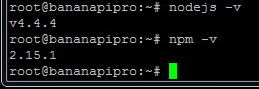
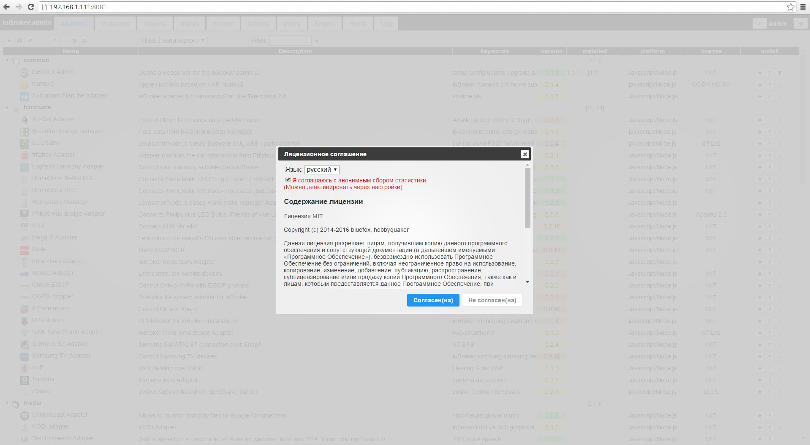
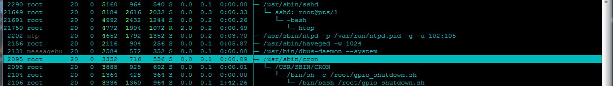

## Описание

Данная инструкция описывает установку ioBroker на различные 
[SBC](https://ru.wikipedia.org/wiki/%D0%9E%D0%B4%D0%BD%D0%BE%D0%BF%D0%BB%D0%B0%D1%82%D0%BD%D1%8B%D0%B9_%D0%BA%D0%BE%D0%BC%D0%BF%D1%8C%D1%8E%D1%82%D0%B5%D1%80) 
с работой под [armbian](http://www.armbian.com/). 
Данная операционная система является "легкой" версией Debian Wheezy, Jessie или Ubuntu Trusty на базе Linux-дистрибутива. 
Полный список железа доступен на [странице проекта](http://www.armbian.com/download/). 
Системы базируются на ядре версии Legacy или Vanilla, необходимо учитывать следующие моменты при выборе образа для скачивания:

*   legacy: ускорение видео, поддержка установки в NAND-память, подключение различных дисплеев,
*   vanilla: использование в качестве быстрого сервера, при использовании графического окружения рекомендуется запускать более легковесные приложения.

Больше информации по самой системе можно прочитать на странице [документации](http://www.armbian.com/documentation/) 
или на [форуме](http://forum.armbian.com/). 
Скачать образ системы и ознакомиться с возможностями конкретного железа можно щелкнув ссылку выбранной платы на 
странице [загрузки](http://www.armbian.com/download/). В данном руководстве в качестве примера используется 
плата [BananaPi](http://www.lemaker.org/product-bananapi-index.html) и [Cubietruck](http://cubieboard.org/model/cb3/) 
с образом [Jessie server](http://www.armbian.com/banana-pi/) на основе ядра Legacy (рекомендуется для лучшей поддержки 
различных интерфейсов вроде OWFS, GPIO, SPI, I2C, LVDS и пр.). 
[Версия](http://www.armbian.com/logbook/) armbian: v5.10 / 1.5.2016 [Версия](https://nodejs.org/en/download/) nodejs/npm: v4.4.4/2.15.1

## Необходимое оборудование

*   Одноплатный компьютер, любой из списка на страничке проекта [armbian](http://www.armbian.com/download/) (в данном примере [Banana Pi](http://www.armbian.com/banana-pi/), [Cubietruck](http://cubieboard.org/model/cb3/)),
*   Блок питания (желательно использовать стабилизированный с током нагрузки от 2А, при подключении HDD не менее 3А),
*   SD карта (предпочтительно выбирать высокоскоростную карту, так как скорость работы системы зависит от скорости чтения/записи карты),
*   патч-корд для подключения к роутеру - доступ в интернет и/или подключению по ssh,
*   кабель HDMI и устройство вывода изображения с поддержкой HDMI (не обязательно),
*   клавиатура/мышь c USB-интерфейсом (не обязательно),
*   аккумуляторная батарея Li-Pol/Li-Ion 3,7В, к примеру батарея элементов [18650](https://ru.wikipedia.org/wiki/%D0%A2%D0%B8%D0%BF%D0%BE%D1%80%D0%B0%D0%B7%D0%BC%D0%B5%D1%80%D1%8B_%D0%B3%D0%B0%D0%BB%D1%8C%D0%B2%D0%B0%D0%BD%D0%B8%D1%87%D0%B5%D1%81%D0%BA%D0%B8%D1%85_%D1%8D%D0%BB%D0%B5%D0%BC%D0%B5%D0%BD%D1%82%D0%BE%D0%B2), соединенных в параллель (не обязательно).

## Важные ссылки

*   Загрузка образа: [http://www.armbian.com/download/](http://www.armbian.com/download/)
*   Архиватор 7zip (Windows) [http://www.7-zip.org/](http://www.7-zip.org/)
*   Putty (ssh-клиент): [http://www.putty.org/](http://www.putty.org/)
*   Программа для записи образа *.raw на SD-карту [https://rufus.akeo.ie/](https://rufus.akeo.ie/)
*   WinSCP (удобно для работы с файловой системой linux из под Windows) [https://winscp.net](https://winscp.net/eng/docs/lang:ru)
*   Документация пользователя armbian [http://www.armbian.com/documentation/](http://www.armbian.com/documentation/)
*   Установка (перенос) системы на HDD/NAND видео-руководство [https://www.youtube.com](https://www.youtube.com/watch?v=6So8MA-qru8)
*   Программа Win32 Disk Imager для чтения и записи на SD-карту различных образов: [https://sourceforge.net/projects/win32diskimager/](https://sourceforge.net/projects/win32diskimager/)
*   Программа Rufus может так же использоваться для работы с SD-картами, USB-носителями: [http://rufus.akeo.ie/](http://rufus.akeo.ie/)

## Описание установки

### Установка Armbian

*   Скачать образ системы для выбранной платы на [сайте](http://www.armbian.com/download/) проекта. Как уже писалось выше, рекомендуется загружать образ на базе ядра версии Legacy (хорошая поддержка различных интерфейсов) и желательно без графического окружения (server).
*   Записать образ системы на SD-карту с помощью программы [rufus](https://rufus.akeo.ie/) (Windows). В окне программы вверху выбрать SD-карту, ниже установить галочку **Создать загрузочный диск** и выбрать из списка **DD-образ**, затем щелкнуть по кнопке выбора образа, найти заранее скачанный и распакованный файл (в формате *.raw) и нажать кнопку **Старт**. 

В Linux/Mac можно воспользоваться командой `dd`: 

`# Linux example: /dev/sdx is your sd card device`

`dd bs=1M if=filename.raw of=/dev/sdx`

`# OS X example: /dev/[r]diskx is your sd card device:`

`diskutil unmountDisk diskx && dd bs=1m if=filename.raw of=/dev/rdiskx && diskutil eject diskx`

*   Для первоначальной настройки есть два варианта: локальная (надо подключить к плате проводом HDMI телевизор/монитор, подключить клавиатуру и, при необходимости, мышь) и по сети (достаточно подключить патч-кордом в локальную сеть с DHCP-сервером).
*   Вставляем в плату SD-карту с образом armbian и подключаем питание. Светодиоды начинают весело моргать, значит все хорошо, загрузка идет.
*   Если локально настраивать систему, то можно сразу начинать работать, если по сети, то надо установить клиент SSH (к примеру программу putty) и подключиться к плате по порту 22\. Узнать выданный IP-адрес (по умолчанию в armbian интерфейс eth0 получает настройки по DHCP) можно через WEB-интерфейс вашего роутера/маршрутизатора или просканировать вашу локальную сеть каким-нибудь сетевым сканером.
*   Первый запуск системы длится немного больше чем обычно, потому как система перераспределяет рабочее пространство для полного использования всей SD-карты, генерируются SSH-ключи, осуществляется настройка сети (запрос по DHCP) и пр. настройки. Если подключен монитор по HDMI, все действия будут отображаться на нем.
*   При первом запуске после успешного входа в систему (по SSH или локально) под учетной записью root (пароль по-умолчанию 1234), запустится скрипт первого запуска и настройки. Система предложит поменять пароль суперпользователя root и создать обычного пользователя с доступом по паролю (который так же предложит ввести). 

*   Далее все команды и настройки осуществляются от суперпользователя (root).

Для удобной работы желательно установить несколько программ, для этого сначала обновим список пакетов и обновим установленные: 

`root@bananapipro:~# apt-get update`

`root@bananapipro:~# apt-get upgrade` 

Установим файловый менеджер mc (пакеты htop, build-essential, curl и wget уже установлены в системе): 

`root@bananapipro:~# apt-get install mc` 

Для начала работы с системой, установки node.js и ioBroker этих настроек достаточно, можно продолжить.

### Установка Node.js

Рассмотрим один из способов установки Node.js в armbian - установка с помощью менеджера пакетов (apt-get) с добавлением репозитория node.js в систему. 
[Этот способ](https://nodejs.org/en/download/package-manager/#debian-and-ubuntu-based-linux-distributions) относительно простой, 
работает на многих разновидностях Linux (включая старые выпуски) и позволяет получать обновления командой `apt-get upgrade`. 

Добавим в систему репозиторий node.js (версия 4): 

`root@bananapipro:~# curl -sL https://deb.nodesource.com/setup_4.x | sudo -E bash -` 

Теперь можно установить node.js: 

`root@bananapipro:~# apt-get install -y nodejs` 

Проверим версии: 

`root@bananapipro:~# nodejs -v` 
`root@bananapipro:~# npm -v` 

### Установка ioBroker

ioBroker устанавливается с помощью менеджера npm. Сначала создадим директорию для установки и 
назначим права записи/чтения для всех пользователей: 

`root@bananapipro:~# mkdir /opt/iobroker` 

`root@bananapipro:~# chmod 777 /opt/iobroker` 

Зайдем во вновь созданную директорию и выполним команду установки: 

`root@bananapipro:~# cd /opt/iobroker` 

`root@bananapipro:/opt/iobroker# npm install iobroker` 

Если при установке появляются ошибки, можно попробовать запустить её с опцией `--unsafe-perm` : 

`root@bananapipro:/opt/iobroker# npm install iobroker --unsafe-perm` 

Если установка прошла удачно и ошибок не было, можно запустить диспетчер процессов Linux - **htop** и 
проверить, запустился ли ioBroker: 

`root@bananapipro:~# htop` 

 

В диспетчере хорошо видно, что присутствуют процессы iobroker.js-controller и экземпляр драйвера admin (io.admin.0), 
последний добавляется в систему автоматически при первой установке ioBroker. 
Можно продолжить основную настройку ioBroker, для этого необходимо перейти на 
страничку администрирования, открыв в браузере адрес `<IP-Адрес сервера>:8081`. 

При первом запуске будет предложено согласиться с условиями лицензии, можно выбрать 
язык интерфейса и отметить опцию об отправке статистики разработчикам системы. 

 

После принятия условий лицензии можно приступать к дальнейшей настройке системы 
через страничку администрирования. Подробнее можно прочитать в документации к 
драйверу [admin](http://www.iobroker.net/?page_id=3800&lang=ru). 

 

На этом основной этап установки и настройки можно считать законченным. Можно устанавливать драйвера, 
настраивать их в системе, писать скрипты и наслаждаться автоматизацией. 
Ниже приводится несколько howto, которые могут оказаться полезными для новичков.

## Полезные дополнения

### Резервная копия, восстановление из резервной копии

**Полный backup.** 

На всех одноплатных ПК, что поддерживаются armbian, система полностью устанавливается на SD (microSD) карту памяти, исключая варианты переноса в NAND-память или жесткий диск HDD. Поэтому есть очень легкий способ создания резервных копий всей системы:

*   выключаем компьютер, отключаем питание, вытаскиваем карту памяти;
*   вставляем карту памяти в рабочий ПК и считываем всю информацию в образ *.img (к примеру программой Win32 Disk Imager под Windows);
*   после завершения записи образа на жесткий диск, переставляем SD-карточку в одноплатный ПК, подключаем питание, работаем дальше...

Теперь, если что то пошло не так (система не запускается, не можете удалить какую то программу или просто "умерла" карта памяти), всегда можно подключить ту же карту (или новую) к ПК и программой Win32 Disk Imager записать последний рабочий образ системы. У этого способа есть два серьезные недостатка, которые вытекают один из другого и один менее заметный:

*   одноплатный ПК необходимо полностью отключить от питания,
*   на время манипуляций с картой памяти, система полностью в offline,
*   все действия необходимо проводить в ручную, отсутствует какая либо автоматизация создания резервных копий.

**Частичный backup.** 

Есть еще один способ создания резервных копий файлов, который лишен недостатков вышеописанного, но так же имеет свои нюансы. Предположим, что необходимо делать резервную копию не всей системы, а только некоторых файлов и папок (ioBroker установлен, настроен и в работе). Для создания бэкапа только ioBroker, можно архивировать средствами упаковщика tar всю папку /opt/iobroker. Для надежности, хранить архивы можно в облаке, к примеру, используя сервис Яндекс.Диск; а создание архивов можно настроить по расписанию (автоматизировать). Если нет аккаунта на Яндексе, самое время зарегистрироваться и подключить сервис Яндекс.Диск. Необходимо выполнить следующие действия:

*   регистрация на [yandex.ru](http://www.yandex.ru), подключение сервиса [Яндекс.Диск](https://disk.yandex.ru),
*   установка и настройка [davfs2](http://savannah.nongnu.org/projects/davfs2),
*   в папку /mnt/yandex.disk автоматически монтируется облако Яндекса с помощью [webdav](https://yandex.ru/support/disk/webdav.xml),
*   создание скрипта архивирования папки /opt/iobroker,
*   добавление в крон исполнение скрипта архивирования по расписанию

Итак, сначала необходимо доустановить в систему необходимые пакеты: 

`root@bananapipro:~# apt-get update`

`root@bananapipro:~# apt-get install davfs2` 

Создадим папку, куда будет монтироваться Яндекс.Диск: 

`root@bananapipro:~# mkdir /mnt/yandex.disk` 

Чтобы не писать пароль пользователя Яндекс в файле `/etc/fstab`, воспользуемся функционалом **davfs2** и добавим строчку логин/пароль 
в файл **secrets**: `root@bananapipro:~# nano /etc/davfs2/secrets` В самый конец файла допишем строку: 

`/mnt/yandex.disk login password`

Теперь добавим информацию в файл `/etc/fstab` для монтирования: 

`https://webdav.yandex.ru /mnt/yandex.disk davfs rw,noexec,auto,users,_netdev,uid=root,gid=root 0 0` 

Можно попробовать монтировать облако в папку `/mnt/yandex.disk`: 

`root@bananapipro:~# mount /mnt/yandex.disk` 

И создадим там папку для хранения архивов резервных копий: 

`root@bananapipro:~# mkdir /mnt/yandex.disk/backup_iobroker` 

Проверим содержимое: 

`root@bananapipro:~# ls -l /mnt/yandex.disk`

`total 0`

`drwxr-xr-x 2 root root 0 Sep 18 2015 backup_iobroker`

`drwx------ 2 root root 0 May 24 20:45 lost+found` 

Можно посмотреть какой объем доступен (при регистрации Яндекс выделяет 10Гб пространства): 

`root@bananapipro:~# df -h`

`Filesystem Size Used Avail Use% Mounted on`

`/dev/mmcblk0p1 7.5G 1.3G 6.1G 18% /`

`udev 10M 0 10M 0% /dev`

`tmpfs 197M 4.5M 193M 3% /run`

`tmpfs 493M 0 493M 0% /dev/shm`

`tmpfs 5.0M 4.0K 5.0M 1% /run/lock`

`tmpfs 493M 0 493M 0% /sys/fs/cgroup`

`tmpfs 493M 4.0K 493M 1% /tmp`

`tmpfs 99M 0 99M 0% /run/user/0`

`https://webdav.yandex.ru 10G 4.9G 5.2G 49% /mnt/yandex.disk` 

Теперь зайдем через WEB-интерфейс и проверим, создалась ли папка в облаке: 

 

Все отлично, Яндекс.диск примонтировался, запись в папку возможна. Создадим скрипт на bash, задачи которого будут:

*   монтировать облако Яндекс.Диск в папку `/mnt/yandex.disk`
*   создать архив папки /opt/iobroker и включить в имя архива текущую дату и время
*   записать результат работы (информационные сообщения и ошибки) в лог файл `/var/log/backup_iobroker.log`

Сам скрипт будет располагаться в папке текущего пользователя root: 

`root@bananapipro:~# nano /root/backup_iobroker.sh` 

Содержание получается следующее: 

`#!/bin/sh`

`SRCDIR="/opt/iobroker"`

`DESTDIR="/mnt/yandex.disk/backup_iobroker"`

`YEAR=`date "+%Y"``

`MONTH=`date "+%m"``

`DAY=`date "+%d"``

`TIME=`date +"%H.%M"``

`echo "${YEAR}-${MONTH}-${DAY} ${TIME} Backup iobroker dir to Yandex.disk" >> /var/log/backup_iobroker.log`

`mount /mnt/yandex.disk >> /var/log/backup_iobroker.log 2>&1`

`cd ${DESTDIR}`

`tar -zcpf ${DESTDIR}/${YEAR}${MONTH}${DAY}_backup-${TIME}.tgz ${SRCDIR} >> /var/log/backup_iobroker.log 2>&1`

`echo "--------------" >> /var/log/backup_iobroker.log` 

Даем права на исполнение: 

`root@bananapipro:~# chmod +x /root/backup_iobroker.sh` 

Можно запустить скрипт вручную и проверить его работу: 

`root@bananapipro:~# /root/backup_iobroker.sh`

`root@bananapipro:~# cat /var/log/backup_iobroker.log`

`2016-05-24 22.10 Backup iobroker dir to Yandex.disk`

`--------------` 

Все отлично, скрипт выполняется. Осталось сделать запись в /etc/crontab: 

`0  10,20   * * *   root    /root/backup_iobroker.sh` 

Она означает: каждый день в 10.00 и 20.00 запускать скрипт `/root/backup_iobroker.sh` от имени пользователя **root**. 
Все, теперь каждый день будет срабатывать два раза в сутки скрипт, который будет сбрасывать 
архив папки `/opt/iobroker` в облако на Яндекс.Диск. В итоге, определенным образом совмещая 
два вышеописанных способа, новичкам можно смело действовать а профи спать спокойно))

### Настройка сети

**Ручная настройка интерфейса eth0**. 

Существуют определенные обстоятельства, которые не позволяют использовать настройки сети, полученные от 
DHCP-сервера (к примеру, сама плата может являться DHCP-сервером или в сети вообще нет такового). 
Рассмотрим пример настройки интерфейса eth0 платы в ручном режиме (manual). Для этого необходимо 
открыть на редактирование файл `/etc/network/interfaces` редактором **nano** или через файловый 
менеджер **mc** командой правки (кнопка **F4**): 

`root@bananapipro:~# nano /etc/network/interfaces` 

В окне увидим примерно следующее содержание: 

`# Wired adapter #1`

`allow-hotplug eth0`

`iface eth0 inet dhcp`

`# hwaddress ether # if you want to set MAC manually`

`# pre-up /sbin/ifconfig eth0 mtu 3838 # setting MTU for DHCP, static just: mtu 3838`

`#`

`# Wired adapter #2`

`#auto eth1`

`# iface eth1 inet dhcp`

`# hwaddress ether # if you want to set MAC manually`

`# pre-up /sbin/ifconfig eth0 mtu 3838 # setting MTU for DHCP, static just: mtu 3838`

`#`

`# Wireless adapter #1`

`#auto wlan0`

`#iface wlan0 inet dhcp`

`# wpa-ssid SSID`

`# wpa-psk xxxxxxxxxxxxxxxxxxxxxxxxxxxxxxxxxxxxxxxxxxxxx`

`# to generate proper encrypted key: wpa_passphrase yourSSID yourpassword`

`#`

`# Local loopback`

`auto lo`

`iface lo inet loopback` 

В этом файле по-умолчанию описаны два интерфейса: железный LAN (**eth0**) и виртуальный **loopback**. 
Для ручной настройки, необходимо строчку `iface eth0 inet dhcp` заменить на `iface eth0 inet static` и ниже 
дописать еще несколько, в итоге получится следующее содержание: 

`# Wired adapter #1`

`allow-hotplug eth0`

`iface eth0 inet static`

`address 192.168.1.111`

`netmask 255.255.255.0`

`gateway 192.168.1.1`

`# hwaddress ether # if you want to set MAC manually`

`# pre-up /sbin/ifconfig eth0 mtu 3838 # setting MTU for DHCP, static just: mtu 3838`

`#`

`# Wired adapter #2`

`#auto eth1`

`# iface eth1 inet dhcp`

`# hwaddress ether # if you want to set MAC manually`

`# pre-up /sbin/ifconfig eth0 mtu 3838 # setting MTU for DHCP, static just: mtu 3838`

`#`

`# Wireless adapter #1`

`#auto wlan0`

`# iface wlan0 inet dhcp`

`# wpa-ssid SSID`

`# wpa-psk xxxxxxxxxxxxxxxxxxxxxxxxxxxxxxxxxxxxxxxxxxxxx`

`# to generate proper encrypted key: wpa_passphrase yourSSID yourpassword`

`#`

`# Local loopback`

`auto lo`

`iface lo inet loopback` 

Далее (если файл редактируется в nano) нажать комбинацию клавиш **Ctrl+O** (сохранить изменения) и **Ctrl+X** 
(выйти из редактора). Возможно, дополнительно придется подредактировать DNS-сервер, 
для этого открываем на редактирование файл `/etc/resolv.conf`

`root@bananapipro:~# nano /etc/resolv.conf` 

Здесь необходимо прописать IP DNS-серверов. Можно использовать локальный, можно прописать 
DNS-сервер google `8.8.8.8`, можно вписать оба: 

`nameserver 192.168.1.10`

`nameserver 8.8.8.8` 

После всех настроек, можно перезагрузиться или перезапустить сеть командой: 

`root@bananapipro:~# /etc/init.d/networking restart` 

Если для работы с платой использовался протокол **ssh**, то соединение разорвется, 
нужно подключиться заново. Теперь можно посмотреть настройки сети, 
для этого воспользуемся командой `ifconfig`, которая выведет на экран все доступные интерфейсы: 

`root@bananapipro:~# ifconfig`

`eth0 Link encap:Ethernet HWaddr 02:c2:06:80:9b:27`

`inet addr:192.168.1.111 Bcast:192.168.1.255 Mask:255.255.255.0`

`inet6 addr: fe80::c2:6ff:fe80:9b27/64 Scope:Link`

`UP BROADCAST RUNNING MULTICAST MTU:1500 Metric:1`

`RX packets:136 errors:0 dropped:0 overruns:0 frame:0`

`TX packets:111 errors:0 dropped:0 overruns:0 carrier:0`

`collisions:0 txqueuelen:1000`

`RX bytes:13531 (13.2 KiB) TX bytes:13701 (13.3 KiB)`

`Interrupt:117`

`lo Link encap:Local Loopback`

`inet addr:127.0.0.1 Mask:255.0.0.0`

`inet6 addr: ::1/128 Scope:Host`

`UP LOOPBACK RUNNING MTU:16436 Metric:1`

`RX packets:286 errors:0 dropped:0 overruns:0 frame:0`

`TX packets:286 errors:0 dropped:0 overruns:0 carrier:0`

`collisions:0 txqueuelen:0`

`RX bytes:126927 (123.9 KiB) TX bytes:126927 (123.9 KiB)` 

Для проверки соединения с internet, можно попробовать пропинговать сервер Яндекс: 

`root@bananapipro:~# ping www.ya.ru`

`PING ya.ru (213.180.204.3) 56(84) bytes of data.`

`64 bytes from www.yandex.ru (213.180.204.3): icmp_seq=1 ttl=56 time=5.11 ms`

`64 bytes from www.yandex.ru (213.180.204.3): icmp_seq=2 ttl=56 time=5.19 ms`

`64 bytes from www.yandex.ru (213.180.204.3): icmp_seq=3 ttl=56 time=5.14 ms`

`64 bytes from www.yandex.ru (213.180.204.3): icmp_seq=4 ttl=56 time=5.12 ms`

`64 bytes from www.yandex.ru (213.180.204.3): icmp_seq=5 ttl=56 time=5.08 ms`

`64 bytes from www.yandex.ru (213.180.204.3): icmp_seq=6 ttl=56 time=5.10 ms`

`64 bytes from www.yandex.ru (213.180.204.3): icmp_seq=7 ttl=56 time=5.13 ms`

`64 bytes from www.yandex.ru (213.180.204.3): icmp_seq=8 ttl=56 time=5.10 ms`

`64 bytes from www.yandex.ru (213.180.204.3): icmp_seq=9 ttl=56 time=5.15 ms`

`64 bytes from www.yandex.ru (213.180.204.3): icmp_seq=10 ttl=56 time=5.16 ms`

`64 bytes from www.yandex.ru (213.180.204.3): icmp_seq=11 ttl=56 time=5.15 ms`

`64 bytes from www.yandex.ru (213.180.204.3): icmp_seq=12 ttl=56 time=5.11 ms`

`64 bytes from www.yandex.ru (213.180.204.3): icmp_seq=13 ttl=56 time=5.16 ms`

`64 bytes from www.yandex.ru (213.180.204.3): icmp_seq=14 ttl=56 time=5.18 ms`

`64 bytes from www.yandex.ru (213.180.204.3): icmp_seq=15 ttl=56 time=5.16 ms`

`64 bytes from www.yandex.ru (213.180.204.3): icmp_seq=16 ttl=56 time=7.58 ms`

`64 bytes from www.yandex.ru (213.180.204.3): icmp_seq=17 ttl=56 time=5.09 ms`

`64 bytes from www.yandex.ru (213.180.204.3): icmp_seq=18 ttl=56 time=5.16 ms`

`^C`

`--- ya.ru ping statistics ---`

`18 packets transmitted, 18 received, 0% packet loss, time 19055ms`

`rtt min/avg/max/mdev = 5.085/5.274/7.585/0.568 ms`

### Настройка звука

Почти на всех одноплатных ПК, что поддерживаются armbian, есть возможность вывода звука на несколько интерфейсов. На всех платах присутствует HDMI, 
почти на всех есть аналоговый выход (3,5 jack) на некоторых есть даже оптика. 
Вывод аудио в ioBroker может понадобиться для работы драйвера **sayit**. 
Как написано в [документации](http://www.iobroker.net/?page_id=4262&lang=ru) 
к этому драйверу, в системе Linux используется программа mpg321, поэтому сначала установим её: 

`root@bananapipro:~# apt-get install -y mpg321` 

Теперь установим драйвер и настроим его следующим образом: 

 

Для проверки можно через консоль попробовать проиграть файл, к примеру 
`/opt/iobroker/iobroker-data/files/sayit.0/tts.userfiles/gong.mp3`, для этого набираем команду: 

`root@bananapipro:~# mpg321 /opt/iobroker/iobroker-data/files/sayit.0/tts.userfiles/gong.mp3` 

В колонках или наушниках, подключенных в разъем 3,5 jack на плате, должен появиться звук. 

 

И тут возникает одна особенность работы звуковой карты на BananaPi (так же работает на Cubietruck, Cubieboard2). 
Дело в том, что драйвер не поддерживает микширование звука на выходе, т.е. 
если уже запущен процесс вывода аудио (к примеру VLC играет онлайн-радио), 
то драйвер sayit не сможет работать, в логе можно найти ошибки вида: 

 

В данном примере на скриншоте видно, что при воспроизведении звука извещения (файл **gong.mp3**) 
драйвер попытался вывести фразу из файла `/opt/iobroker/node_modules/iobroker.sayit/say.mp3` , 
т.е. два процесса одного плеера mp321 попытались одновременно воспользоваться драйвером 
звуковой карты. Чтобы исключить такие моменты, можно вручную настроить микширование. 
Для этого создадим файл `/etc/asound.conf` со следующим содержимым: 

`pcm.!default {`

`  type plug`

`  slave.pcm "dmixer"`

`}`

`pcm.dmixer {`

`  type dmix`

`  ipc_key 1024`

`  ipc_perm 0666`

`  slave {`

`    pcm "hw:0,0"`

`    period_time 0`

`    period_size 1024`

`    buffer_size 4096`

`    rate 44100`

`  }`

`}`

`ctl.dmixer {`

`  type hw`

`  card 0`

`}` 

В этом файле мы создаем виртуальный интерфейс **dmixer** и к нему слейвом подключаем реальную звуковую карту. В настройках **slave** указывается:

*   `pcm "hw:0,0"` - это устройство card **0**, device **0** (аналоговый вывод через 3,5 jack)
*   `pcm "hw:1,0"` - это устройство card **1**, device **0** (цифровой вывод через HDMI)

Теперь можно попробовать одновременно запустить два потока аудио и проверить, будет ли наложение:

*   можно запустить вывод какого-нибудь длинного аудио-файла **mp3** программой **mpg321** и одновременно использовать драйвер **sayit**
*   либо установить второй экземпляр драйвера **sayit** и попробовать использовать оба одновременно с одинаковыми настройками вывода звука

В системе есть еще одна программа, которую стоит упомянуть в данном руководстве. Это утилита alsamixer, с 
её помощью можно настроить уровни записи воспроизведения, выбрать устройство вывода звука по-умолчанию, 
получить информацию по всем устройствам и много чего еще. Запускается она просто, в консоли набрать команду: 

`root@bananapipro:~# alsamixer` 

Экран консольный, управление стрелочками вверх/вниз, вправо/влево, на экране указаны функциональные клавиши. 

### Подключение и использование жесткого диска

На некоторых одноплатных компьютерах имеется SATA-разъем и разъем питания. С помощью специальных кабельных сборок можно к плате подключить жесткий диск. 
Его смонтировать в определенную папку и использовать как хранилище данных 
(к примеру перенести на него БД mySQL, лог-файлы и т.д.), или поделить на разделы и перенести на него систему, 
swap, логические диски и пр. Рассмотрим второй вариант. Итак, подключаем жесткий диск 
(плата должна быть отключена от питания), загружаемся и проверяем,  как он определился: 

`root@bananapipro:/# fdisk -l`

`Disk /dev/sda: 59.6 GiB, 64023257088 bytes, 125045424 sectors`

`Units: sectors of 1 * 512 = 512 bytes`

`Sector size (logical/physical): 512 bytes / 512 bytes`

`I/O size (minimum/optimal): 512 bytes / 512 bytes`

`Disklabel type: dos`

`Disk identifier: 0xdce5d50d`

`Disk /dev/mmcblk0: 7.5 GiB, 8077180928 bytes, 15775744 sectors`

`Units: sectors of 1 * 512 = 512 bytes`

`Sector size (logical/physical): 512 bytes / 512 bytes`

`I/O size (minimum/optimal): 512 bytes / 512 bytes`

`Disklabel type: dos`

`Disk identifier: 0x000b2ef5`

`Device Boot Start End Sectors Size Id Type`

`/dev/mmcblk0p1 4096 15775743 15771648 7.5G 83 Linux` 

Видно, что в системе подключена SD-карта - **/dev/mmcblk0p1** и искомый HDD - **/dev/sda**. 
В [документации](http://www.armbian.com/documentation/) на сайте armbian указано, 
что для переноса системы на устройство SATA (USB) необходимо сначала разбить жесткий диск - "pre-partitioned SATA or USB storage". 
Воспользуемся командой fdisk: 

`root@bananapipro:/# fdisk /dev/sda` 

Директива **m** - это help. 
Директива **d** удалит существующие разделы (используем **d** пока не появится сообщение что разделов больше нет). 
Создаем новый раздел, нажимаем **n** - выбираем **p** primary - номер партиции **1** - первый 
сектор по умолчанию оставляем - **last sector** пишем **+1024M**. 
Нажимаем **p** - посмотрим что получилось (в примере используется SSD 64Гб): 

`Device Boot Start End Sectors Size Id Type`

`/dev/sda1 2048 2099199 2097152 1G 83 Linux` 

Для swap надо Id поменять на 82, нажимаем **t** (у нас одна партиция пока, система не 
предлагает выбрать, ставит по умолчанию "Selected partition 1") - пишем **82**. 
Нажимаем **p** - посмотрим что получилось. 

`Device Boot Start End Sectors Size Id Type`

`/dev/sda1 2048 2099199 2097152 1G 82 Linux swap / Solaris` 

Теперь делаем раздел для rootfs. Директива **n** - затем **p** - 
номер партиции **2** - первый сектор по умолчанию оставляем - last sector так же по-умолчанию 
(все оставшееся место) - создали /dev/sda2. Нажимаем **p** - посмотрим что получилось. 

`Device Boot Start End Sectors Size Id Type`

`/dev/sda1 2048 2099199 2097152 1G 82 Linux swap / Solaris`

`/dev/sda2 2099200 125045423 122946224 58.6G 83 Linux` 

Обязательно надо записать данные в файловую таблицу - выбираем директиву **w** - 
происходит запись на диск и программа fdisk завершает свою работу. 

Отформатируем раздел /dev/sda2: 

`root@bananapipro:/# mkfs.ext4 /dev/sda2` 

Теперь можно запустить скрипт установки системы на SATA: 

`root@bananapipro:/# nand-sata-install` 

Откроется диалоговое окно консольного вида, где будет предложено куда устанавливать (в примере используется плата BananaPi, на ней нет NAND, 
поэтому доступен только один вариант SATA/USB): 

И затем запросят информацию, какой именно раздел SATA HDD использовать (в примере **/dev/sda1** - 
это будущий swap, поэтому указываемым **/dev/sda2**): 

 

На предупреждение, о потере данных на **/dev/sda2**, отвечаем утвердительно. 

 

Далее будут отображаться сообщения процесса установки: 

 

Форматирование HDD, копирование файлов и настройка система на загрузку с HDD могут занять продолжительное 
время. В конце скрипт отрапортует что все хорошо и предложит перезагрузиться, соглашаемся. 

 

После загрузки системы можно посмотреть сколько места в корне (rootfs) и где теперь SD-карта: 

`root@bananapipro:~# df -h`

`Filesystem Size Used Avail Use% Mounted on`

`/dev/sda2 58G 1.5G 54G 3% /`

`udev 10M 0 10M 0% /dev`

`tmpfs 197M 4.5M 193M 3% /run`

`tmpfs 493M 0 493M 0% /dev/shm`

`tmpfs 5.0M 4.0K 5.0M 1% /run/lock`

`tmpfs 493M 0 493M 0% /sys/fs/cgroup`

`tmpfs 493M 4.0K 493M 1% /tmp`

`/dev/mmcblk0p1 7.5G 1.3G 6.1G 18% /boot`

`tmpfs 99M 0 99M 0% /run/user/0` 

Корень файловой системы на **/dev/sda2** и объем около 58Гб - отлично! 
Карта памяти теперь смонтирована в **/media/mmc**, загрузка из **/boot** в **/dev/mmcblk0p1**. 
Теперь перенесем swap на жесткий диск. По-умолчанию он в виде файла-образа и
находится в папке `/var/swap` 127Мб. Сначала отключим текущий: 
`root@bananapipro:~# swapoff --all` 

Из файла /etc/fstab удалим (точнее временно закомментируем символом "#" строчку) `/var/swap none swap sw 0 0` 

Перезагружаемся, проверяем: 
`root@bananapipro:~# free -m`

`           total    used    free    shared    buffers    cached`

`Mem:       984      173     810     4         13         51`

`-/+ buffers/cache:  109     875`

`Swap:      0        0       0` 

Отлично, swap отсутствует, можно смело удалить файл `/var/swap.` 
Как писалось выше, был создан раздел **/dev/sda1** он как раз для swap-файла. 
Редактируем файл **/dev/fstab** - строку `/var/swap none swap sw 0 0` (ранее под комментарием теперь убираем символ "#") 
меняем на `dev/sda1 swap swap defaults 0 0`. 

Забиваем **/dev/sda1** нулями (не обязательно): 
`root@bananapipro:~# dd if=/dev/zero of=/dev/sda1 bs=1024 count=2048K` 

Теперь создаем swap: 
`root@bananapipro:~# mkswap /dev/sda1`

`root@bananapipro:~# swapon /dev/sda1` 

Можно перезагрузиться и проверить swap: 

`root@bananapipro:~# free -m`

`          total     used    free    shared    buffers    cached`

`Mem:      984       173     810     4         13         51`

`-/+ buffers/cache:  109     875`

`Swap:     1000      0       1000` 

Отлично, с настройкой жесткого диска и переносом системы закончили.

### Подключение Li-pol/Li-ion аккумулятора

Некоторые платы на борту имеют контроллер питания, который поддерживает подключение аккумуляторной батареи 
(к примеру чип **AXP209**). Такой чип установлен на плате [BananaPi](http://www.lemaker.org/product-bananapi-index.html), 
[Cubietruck](http://cubieboard.org/model/cb3/) и некоторых других... Поддерживаются аккумуляторы 3,7В, к примеру 
батарея на 5000мАч от планшетного ПК, элемент питания 18650 так же подойдет (можно соединить несколько параллельно). 
Контроллер **AXP209** на этих платах, если присутствует внешнее питание, постоянно подзаряжает батарею, как 
только внешнее питание пропадает, плата работает от АКБ. Хотя АКБ всего 3,7В, на платах имеется регулятор напряжения, 
который позволяет работать HDD (если подключен к разъемам питания на плате) так же от аккумулятора. 
На плате Cubietruck имеется разъем типа **JST XH 2.5 2-Pin** для подключения АКБ. 

 

На плате bananapi разъем отсутствует - можно подпаять к площадкам провода или припаять новый разъем. 

 

В качестве примера, подключим аккумулятор Li-Pol 3.7V 5000mAh к плате cubietruck. 
Подключение необходимо производить на полностью обесточенной плате. После запуска 
системы, можно посмотреть параметры АКБ, делается это командой **cat** (к примеру): 

`root@cubietruck:~# cat /sys/class/power_supply/battery/uevent`

`POWER_SUPPLY_NAME=battery`

`POWER_SUPPLY_MODEL_NAME=battery`

`POWER_SUPPLY_STATUS=Charging`

`POWER_SUPPLY_PRESENT=1`

`POWER_SUPPLY_ONLINE=0`

`POWER_SUPPLY_HEALTH=Good`

`POWER_SUPPLY_TECHNOLOGY=Li-ion`

`POWER_SUPPLY_VOLTAGE_MAX_DESIGN=4200000`

`POWER_SUPPLY_VOLTAGE_MIN_DESIGN=3300`

`POWER_SUPPLY_VOLTAGE_NOW=4138000`

`POWER_SUPPLY_CURRENT_NOW=412000`

`POWER_SUPPLY_ENERGY_FULL_DESIGN=2100`

`POWER_SUPPLY_CAPACITY=99`

`POWER_SUPPLY_TEMP=300` 

Здесь полезная информация:

*   `POWER_SUPPLY_STATUS=Charging` - состояние системы питания на данный момент (зарядка АКБ),
*   `POWER_SUPPLY_ONLINE=0` - если внешнее питание есть = **"0"**, если нет (питание от АКБ) = **"1"**,
*   `POWER_SUPPLY_VOLTAGE_NOW=4138000` - текущее напряжение на АКБ (в мкВ),
*   `POWER_SUPPLY_CURRENT_NOW=412000` - текущий ток (в мкА),
*   `POWER_SUPPLY_CAPACITY=99` - текущая емкость (в %).

Можно использовать эту информацию для написания собственных скриптов или драйвера, но с параметром `POWER_SUPPLY_CAPACITY` 
надо быть аккуратнее, так как в системе прописана АКБ по-умолчанию емкостью 2100мАч, 
а в примере используется 5000мАч. Эту настройку можно подкорректировать. Текущая версия 
сборки armbian v5.10 / 1.5.2016 (в более поздних формат файлов и их расположение может поменяться), 
необходимо сверить с информацией на [сайте](http://www.armbian.com/) проекта. **Внимание!!!** 

Редактировать файл `/boot/script.bin` нужно очень аккуратно!!! Если не знаете на 100% за что отвечает тот или иной параметр, 
плата может не загрузиться, а в худшем варианте, сломаться!!! Основные настройки платы находятся в файле `/boot/script.bin` 
на SD-карте (даже если система установлена на HDD). Однако, начиная с версии armbian 4.5, это ссылка на 
файл конкретной платы в папке `/boot/bin`, в случае с cubietruck это - `/boot/bin/cubietruck.bin`.
Чтобы при последующем обновлении системы настройки не потерялись, скопируем файл `/boot/bin/cubietruck.bin` в `/boot/script.bin` 
и, на всякий случай, в директорию пользователя, к примеру `/root` (резервная копия). 

`root@cubietruck:~# cp /boot/bin/cubietruck.bin /boot/script.bin`

`root@cubietruck:~# cp /boot/script.bin /root/script.bin.backup` 

Теперь распакуем файл `/boot/script.bin` с помощью утилиты **bin2fex** в ту же директорию. 

`root@cubietruck:~# bin2fex /boot/script.bin /boot/script.fex`

`fexc-bin: /boot/script.bin: version: 0.1.2`

`fexc-bin: /boot/script.bin: size: 46404 (83 sections)` 

Файл `/boot/script.fex` уже в редактируемом формате, его можно открыть в любом текстовом 
редакторе. В этом файле интересует настройка **pmu_battery_cap** в секции **[pmu_para]**. 
Её значение по-умолчанию 2100, меняем на 5000 (емкость АКБ в даном примере), 
сохраняем, и конвертируем файл обратно в `/boot/script.bin` утилитой **fex2bin**:

`root@cubietruck:~# fex2bin /boot/script.fex /boot/script.bin` 

Для примерения настроек, необходимо перезагрузиться. Можно проверить состояние АКБ: 

`root@cubietruck:~# cat /sys/class/power_supply/battery/uevent`

`POWER_SUPPLY_NAME=battery`

`POWER_SUPPLY_MODEL_NAME=battery`

`POWER_SUPPLY_STATUS=Charging`

`POWER_SUPPLY_PRESENT=1`

`POWER_SUPPLY_ONLINE=0`

`POWER_SUPPLY_HEALTH=Good`

`POWER_SUPPLY_TECHNOLOGY=Li-ion`

`POWER_SUPPLY_VOLTAGE_MAX_DESIGN=4200000`

`POWER_SUPPLY_VOLTAGE_MIN_DESIGN=3300`

`POWER_SUPPLY_VOLTAGE_NOW=4090000`

`POWER_SUPPLY_CURRENT_NOW=414000`

`POWER_SUPPLY_ENERGY_FULL_DESIGN=5000`

`POWER_SUPPLY_CAPACITY=89`

`POWER_SUPPLY_TEMP=300` 

Видно, что емкость АКБ теперь не 2100, а 5000 - параметр 
`POWER_SUPPLY_ENERGY_FULL_DESIGN` 
**Внимание!!!** Редактировать файл `/boot/script.bin` нужно очень аккуратно!!! 
Если не знаете на 100% за что отвечает тот или иной параметр, плата может не загрузиться, а в худшем варианте, сломаться!!!
С помощью скрипта можно собирать данные о плате, в частности состояние системы питания. 
Вот так, к примеру, может выглядеть график разряда-заряда АКБ на плате cubietruck: 

 

На скриншоте хорошо видно, что в 21.00 пропало основное питание (зеленый и синий графики - напряжение и ток), плата 
работает от АКБ (красный график - ток разряда от АКБ, желтый и фиолетовый - напряжение и условная величина - емкость). 
В момент времени примерно 00.00 основное питание восстановилось и контроллер начал заряжать АКБ:

*   красный график (ток через АКБ) после включения основного питания сгладился и со временем стал приближаться к нулю - аккумулятор зарядился,
*   синий график (ток от основного источника питания) сначала резкий скачок - и плата работает и АКБ заряжается, по мере приближения к полному заряду АКБ ток уменьшался до выхода на режим питания только платы
*   желтый график (напряжение на АКБ) после отключения основного питания напряжение "просело" и стало уменьшаться - АКБ разряжается, после подключения основного питания, напряжение стало расти до номинального (полностью заряженная АКБ)
*   фиолетовый график (емкость) условная величина остаточной емкости АКБ в %
*   зеленый график (напряжение основного источника питания) после отключения основного питания напряжение равно нулю, как питание появилось, на графике хорошо видно, что оно немного "просело" - в следствии большего потребляемого тока (заряд АКБ + работа самой платы) и затем вышло на номинал (АКБ зарядилась)

### Работа с портами ввода-вывода GPIO из ioBroker

Порты GPIO используются как порты ввода-вывода и конфигурируются в системе при загрузке. В примере используется плата BananaPi. **Внимание****!!!** 
Почти все порты ввода-вывода подключены практически напрямую к чипу SBC! Работать с ними нужно очень аккуратно! 
Подключение/переключение производить только при полностью обесточенной плате! 
Перед включением несколько раз все проверить! "Выгорание" определенного порта 
может вызвать цепную реакцию и сжечь всю группу или чип полностью! Так же необходимо 
изучить документацию на чип, к которому подключаетесь и схему платы, некоторые платы работают 
с уровнем логики 3,3В, некоторые 5В - это надо учитывать! Чтобы понять, какие порты можно
использовать в системе как ввод-вывод, а какие нельзя (не сконфигурированы, заняты под другие нужды - I2C, UART, SPI и пр.), 
необходимо проанализировать файл script.bin в директории `/boot`. **Внимание!!!** Редактировать файл `/boot/script.bin` 
нужно очень аккуратно!!! Если не знаете на 100% за что отвечает тот или иной параметр, плата может не загрузиться, 
а в худшем случае, сломаться!!! Текущая версия сборки armbian v5.10 / 1.5.2016 (в более поздних формат файлов и их 
расположение может поменяться), необходимо сверить с информацией на [сайте](http://www.armbian.com/) проекта. 
Основные настройки платы находятся в файле `/boot/script.bin` на SD-карте (даже если система установлена на HDD). 
Однако, начиная с версии armbian 4.5, это ссылка на файл конкретной платы в папке `/boot/bin`, 
в случае с bananapi это - `/boot/bin/bananapi.bin`. Чтобы при последующем обновлении системы настройки не потерялись, 
скопируем файл `/boot/bin/bananapi.bin` в `/boot/script.bin` и, на всякий случай, в директорию пользователя, 
к примеру `/root` (резервная копия). 
 
`root@bananapi:~# cp /boot/bin/bananapi.bin /boot/script.bin`

`root@bananapi:~# cp /boot/script.bin /root/script.bin.backup` 

Теперь распакуем файл `/boot/script.bin` с помощью утилиты **bin2fex** в ту же директорию. 

`root@bananapi:~# bin2fex /boot/script.bin /boot/script.fex`

`fexc-bin: /boot/script.bin: version: 0.1.2`

`fexc-bin: /boot/script.bin: size: 46404 (83 sections)` 

Файл `/boot/script.fex` уже в редактируемом формате, его можно открыть в любом текстовом редакторе. 
В этом файле интересует настройки в секции **[gpio_para]**. 

Настройка **gpio_used** должна быть равна **1** (использование разрешено) и 
далее описание всех задействованных портов. Однако, их не все можно использовать, так как
некоторые могут быть заняты на шинах I2C, SPI, UART и на прочем оборудовании периферии чипа. 
Для примера, рассмотрим порты:

*   `gpio_pin_1 = port:PB20<1><default><default><default>` Этот порт объявлен как **gpio1**, подключен к чипу **[А20](http://linux-sunxi.org/A20/PIO)** ([bananapi](http://wiki.lemaker.org/BananaPro/Pi:Pin_definition)) на порт **[PB20](http://linux-sunxi.org/A20/PIO#PB20_.2852.29)** (группа B). Если пройтись поиском по ключевому слову **PB20**, то можно увидеть, что этот порт уже занят на шине I2C (секция **[twi2_para]** настройка `twi2_scl = port:PB20<2><default><default><default>`) и он выведен на контактную колодку **[CON3](http://wiki.lemaker.org/BananaPro/Pi:Pin_definition)** платы. Его использовать не получится.
*   `gpio_pin_15 = port:PH01<1><default><default><default>` Этот порт объявлен как **gpio15**, подключен к чипу [**А20**](http://linux-sunxi.org/A20/PIO) на порт **[PH01](http://linux-sunxi.org/A20/PIO#PH01_.28225.29)** (группа H). Если пройтись поиском по ключевому слову **PH01**, то встречается этот порт в секции **[lcd1_para]**, но она отключена настройкой **lcd_used = 0**, **[uart_para3]**, но этот порт так же отключен настройкой **uart_used = 0**. То есть порт **gpio15** свободен в системе, к тому же, он выведен на контактную колодку **[CON3](http://wiki.lemaker.org/BananaPro/Pi:Pin_definition)** платы - pin10\. Отлично, его можно использовать как порт ввода-вывода!

Таким образом можно проверить все порты ввода-вывода, чтобы определить, какие можно задействовать, а какие нельзя. Если же нужный порт занят, к примеру, 
на порту UART5, который вы не собираетесь использовать, то его 
можно отключить настройкой **uart_used = 0** и задействовать в секции **[gpio_para]**. 
Однако нужно действовать аккуратно, так как этот порт может использоваться на плате каким любо интерфейсом 
(к примеру, UART0 по-умолчанию настроен на вывод сообщений debug) или для управление чипом Ethernet, 
для управления питанием портов USB, для управление светодиодами и пр. При отладке, можно контролировать 
состояние портов GPIO в системе специальной программой, к примеру [WiringBP](https://github.com/LeMaker/WiringBP) (для платы BananPi). 
Установка описана на сайте [github](https://github.com/LeMaker/WiringBP) и на страничке [WiKi](http://wiki.lemaker.org/BananaPro/Pi:GPIO_library#WiringPi): 

`root@bananapi:~# git clone https://github.com/LeMaker/WiringBP.git -b bananapi`

`Cloning into 'WiringBP'...`

`remote: Counting objects: 238, done.`

`remote: Total 238 (delta 0), reused 0 (delta 0), pack-reused 237`

`Receiving objects: 100% (238/238), 213.98 KiB | 133.00 KiB/s, done.`

`Resolving deltas: 100% (122/122), done.`

`Checking connectivity... done.` 

Выполняем установку: 

`root@bananapi:~# cd WiringBP/`

`root@bananapi:~/WiringBP# ls -l`

`total 44`

`-rw-r--r-- 1 root root 1943 Jun  7 17:08 build`

`-rw-r--r-- 1 root root 7651 Jun  7 17:08 COPYING.LESSER`

`drwxr-xr-x 2 root root 4096 Jun  7 17:08 devLib`

`drwxr-xr-x 6 root root 4096 Jun  7 17:08 examples`

`drwxr-xr-x 2 root root 4096 Jun  7 17:08 gpio`

`-rw-r--r-- 1 root root  686 Jun  7 17:08 INSTALL`

`-rw-r--r-- 1 root root 1005 Jun  7 17:08 People`

`drwxr-xr-x 2 root root 4096 Jun  7 17:08 pins`

`-rw-r--r-- 1 root root  912 Jun  7 17:08 README.md`

`drwxr-xr-x 2 root root 4096 Jun  7 17:08 wiringPi`

`root@bananapi:~/WiringBP# chmod +x ./build`

`root@bananapi:~/WiringBP# ./build` 

Проверяем работу: 

`root@bananapi:~/WiringBP# gpio -v`

`gpio version: 2.14`

`Copyright (c) 2012-2014 Gordon Henderson`

`This is free software with ABSOLUTELY NO WARRANTY.`

`For details type: gpio -warranty`

`This Raspberry Pi is a revision 3 board.` 

Считаем параметры всех gpio: 

`root@bananapi:~/WiringBP# gpio readall`

`+----------+-Rev3-+------+--------+------+-------+`

`| wiringPi | GPIO | Phys | Name   | Mode | Value |`

`+----------+------+------+--------+------+-------+`

`|      0   |  17  |  11  | GPIO 0 | IN   | Low   |`

`|      1   |  18  |  12  | GPIO 1 | IN   | Low   |`

`|      2   |  27  |  13  | GPIO 2 | IN   | Low   |`

`|      3   |  22  |  15  | GPIO 3 | IN   | Low   |`

`|      4   |  23  |  16  | GPIO 4 | IN   | Low   |`

`|      5   |  24  |  18  | GPIO 5 | IN   | High  |`

`|      6   |  25  |  22  | GPIO 6 | IN   | Low   |`

`|      7   |   4  |   7  | GPIO 7 | IN   | Low   |`

`|      8   |   2  |   3  | SDA    | ALT5 | High  |`

`|      9   |   3  |   5  | SCL    | ALT5 | High  |`

`|     10   |   8  |  24  | CE0    | ALT5 | Low   |`

`|     11   |   7  |  26  | CE1    | ALT5 | Low   |`

`|     12   |  10  |  19  | MOSI   | ALT5 | Low   |`

`|     13   |   9  |  21  | MISO   | ALT5 | Low   |`

`|     14   |  11  |  23  | SCLK   | ALT5 | Low   |`

`|     15   |  14  |   8  | TxD    | OUT  | High  |`

`|     16   |  15  |  10  | RxD    | OUT  | High  |`

`|     17   |  28  |   3  | GPIO 8 | IN   | Low   |`

`|     18   |  29  |   4  | GPIO 9 | ALT4 | Low   |`

`|     19   |  30  |   5  | GPIO10 | OUT  | High  |`

`|     20   |  31  |   6  | GPIO11 | ALT4 | Low   |`

`+----------+------+------+--------+------+-------+` 

В этой таблице описаны порты GPIO только на контактах колодки **[CON3](http://wiki.lemaker.org/File:PIN_CONNECTOR.jpg)** 
платы BananaPi и только те, которыми теоретически можно управлять (то есть исключены железные +5В, +3В, GND). 
К примеру:

*   wiringPi = 6\. Порт на колодке **[CON3](http://wiki.lemaker.org/File:PIN_CONNECTOR.jpg)** физический - **pin22**, в системе как **gpio25** (gpio25 в файле `/boot/script.bin` **[PI16](http://linux-sunxi.org/A20/PIO#PI16_.28272.29)** - свободен) работает как **IN** (ввод) текущее значение **Low**.
*   wiringPi = 15\. Порт на колодке **[CON3](http://wiki.lemaker.org/File:PIN_CONNECTOR.jpg)** физический - **pin8**, в системе как **gpio14** (gpio14 в файле `/boot/script.bin` **[PH00](http://linux-sunxi.org/A20/PIO#PH00_.28224.29)** - в секции **[usbc0]** - порт используется как `usb_restric_gpio = port:PH00<1><0><default><0>`, использовать не получится) назначение **TxD** порта **UART3** (отключен) работает как **OUT** текущее значение **HIGH**.

Как работать с портами из консоли, описано на [страничке WiKi](http://wiki.lemaker.org/How_to_control_the_IO_on_the_SBC_boards#Use_sysfs_user_space) разработчика BananaPi. 
Сейчас рассмотрим работу в системе ioBroker. Для этого нужно [установить](http://www.iobroker.net/?page_id=3800&lang=ru#i-7) 
драйвер Javascript/Coffescript Script Engine и в настройках прописать дополнительный пакет npm - [gpio](https://github.com/EnotionZ/GpiO): 

 

Результат установки (успех или ошибки) в лог-файле `/opt/iobroker/log`: 

`javascript.0 npm install gpio --production --prefix "/opt/iobroker/node_modules/iobroker.javascript"`

`javascript.0 gpio@0.2.7 opt/iobroker/node_modules/iobroker.javascript/node_modules/gpio`

`javascript.0 requesting all states`

`javascript.0 requesting all objects`

`javascript.0 received all states`

`javascript.0 received all objects` 

Эта библиотека хороша тем, что можно ["подписываться"](img/GpiO#eventemitter) на изменение состояния портов gpio, 
помеченных как in (вход) вместо того, что постоянно опрашивать с определенным интервалом. 
Для примера, разберем простой скрипт - включение/отключение светодиода (инвертирование состояния) кнопкой:

*   gpio25 физический pin22 контактной площадки CON3 - подключаем кнопку нормально разомкнутую без фиксации с подтяжкой pin22 к GND
*   gpio24 физический pin18 подключаем светодиод на +5V через токо-ограничивающий резистор 10КОм

Текст скрипта: 

`var gpio = require("gpio"); //подключаем библиотеку` 
`//pin18 gpio24 подключен светодиод, направление out (выход)` 
`var gpio24 = gpio.export(24, {direction: "out"});` 
`//pin22 gpio25 подключена кнопка, направление in (вход)` 
`var gpio25 = gpio.export(25, {direction: "in"});` 
`//Подписываемся на срабатывание gpio 25 (нажали/отпустили) и инвертируем состояние gpio24 только при нажатой кнопке` 
`gpio25.on("change", function(val) {` 
`  //Инвертируем только при нажатой кнопке` 
`  if (val) {` 
`    gpio24.set(gpio24.value - 1);` 
`  }` 
`});` 
`//Завершается работа скрипта, отписываемся от gpio25 и удаляем настройки всех gpio` 
`onStop(function () {`

`  gpio25.removeAllListeners("change");`

`  gpio24.unexport();`

`  gpio25.unexport();`

`  log("Stop script. All unexport done!");`

`}, 1000 /*ms*/);`

### Настройка отключения системы shutdown кнопкой GPIO

Почти на всех платах одноплатных компьютеров, которые поддерживает armbian, имеются контакты портов 
[GPIO](https://ru.wikipedia.org/wiki/GPIO). Для примера используется плата 
[BananaPi](http://wiki.lemaker.org/BananaPro/Pi:Pin_definition), которая содержит разъем con3 
на 26 контактов, их назначение следующее: 

 

Для подключения кнопки будет использован **pin_22** на картинке обозначен как **IO-6** в системе armbian он обозначается как **GPIO25**. 
Этот контакт через резистор 10К подключаем к GND (**pin_25**) - "подтяжка к земле". Кнопку (нормально открытый контакт без фиксации) 
подключаем к **pin_22** (GPIO25) и **pin_02** (+5В). При замыкании на **GPIO25** появится логическая "1", если отпустить кнопку, 
будет логический "0". Скрипт запускается от имени пользователя root: 

`root@bananapipro:~# nano /root/gpio_shutdown.sh` 

Содержание будет приблизительно следующее: 

`#! /bin/bash`

`# Set up GPIO25 and set to input`

`echo "25" > /sys/class/gpio/export`

`echo "in" > /sys/class/gpio/gpio25/direction`

`while ( true ) `

`do`

`    # check if the pin is connected to +5V and, if so, halt the system`

`    if [ $(</sys/class/gpio/gpio25/value) == 1 ]`

`    then`

`        echo "25" > /sys/class/gpio/unexport`

`        shutdown -h now "System halted by a GPIO action"`

`    fi `

`    sleep 1`

`done` 

Даем права на исполнение: 

`root@bananapipro:~# chmod +x /root/gpio_shutdown.sh` 

Проверить работу можно запустив скрипт и нажав на кнопку, в консоли должно появиться сообщение `"System halted by a GPIO action"` и система выключится. 
Добавляем в конец файла /etc/crontab строчку: 

`@reboot root /root/gpio_shutdown.sh` 

Она обозначает: запуск скрипта 
от имени пользователя root при запуске системы (опция **@reboot**). Теперь после перезагрузки можно убедиться, 
что скрипт запущен и ожидает срабатывания порта **GPIO25**, для этого запустим диспетчер **htop**: 

### Настройка временной зоны, клавиатуры и вывода в консоль

Чтобы выбрать временную зону, нужно набрать следующую команду: 

`root@bananapipro:~# dpkg-reconfigure tzdata` 

На экране отобразится консольное окно для выбора временной зоны. Если необходимо задать время МСК (+3), то выбираем **Europe**, 
затем листаем вверх/вниз и ищем **Moscow**, подтверждаем выбор клавишей enter. 

`Current default time zone: 'Europe/Moscow'`

`Local time is now: Wed May 25 15:36:10 MSK 2016.`

`Universal Time is now: Wed May 25 12:36:10 UTC 2016.` 

Для настройки клавиатуры, необходимо выполнить следующую команду: 

`root@bananapipro:~# dpkg-reconfigure keyboard-configuration` 

И далее на экране в консольном окне выбрать искомую модель клавиатуры, выбрать раскладку, 
способ переключения между языками и ответить на некоторые другие вопросы. Чтобы настроить 
текстовый вывод в консоль, нужно выполнить команду: 

`root@bananapipro:~# dpkg-reconfigure console-setup` 

В открывшемся диалоге нужно выбрать кодировку (**UTF-8**), поддерживаемый набор символов (**Guess optimal character set**), 
шрифт (можно выбрать **Terminus**) и размер шрифта (**8х16**). Чтобы изменения вступили в силу, нужно заново войти в систему.