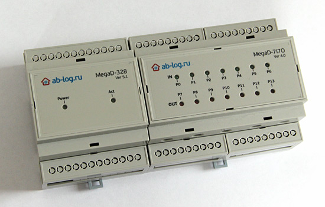

## Настройки

*   IP Адрес устройства: IP адрес MegaD-328;
*   MegaD Имя: Имя MegaD-328 устройства для идентификации сообщений о смене состояния порта от MegaD-328, например "DevA". Если имя не задано, то для этих целей будет использоватся номер инстанции драйвера.;
*   ioBroker веб-порт: Порт на котором ioBroker разворачивает веб сервер для приёма сообщений от MegaD-328\. MegaD-328 не поддерживает на данный момент порты отличные от 80\. Значение по умолчанию: 80.
*   Интервал опроса (сек): инетрвал опроса портов в секундах;
*   MegaD-328 Пароль: пароль для доступа на MegaD-328 (максимально 3 символа). Значение по умолчанию: "sec";
*   Интервал для длинного нажатия (мс): если отжатие после нажатия кнопки произошло позже указанного интервала, то сгенерируется длинное нажатие;
*   Интервал двойного нажатия (мс): если между нажатиями пройдет меньше указанного времени, то сгенерируется двойное нажатие;

В сетевых настройках MegaD-328 можно сконфигуририровать IP-адрес ioBroker. При каждом нажатии на кнопку MegaD-328 сообщает ioBroker (restAPI) номер сработавшего входа. Выглядит запрос примерно следующим образом: [http://192.168.0.250/0/?pt=7](http://192.168.0.250/0/?pt=7%C2%B4%C2%B4%C2%B4)

### Порты

Необходимо сконфигурироваь все порты, которые должны быть видимы в ioBorker. Для каждого порта необходимо настроить следующее:

*   Имя: имя порта. Исползуется в ioBroker для создание объектов;
*   Вход: является ли порт входом (true) или выходом(false);
*   Переключатель: Может ли порт быть в положениях ВКЛ и ВЫКЛ (в этом случае значение TRUE) или он просто используется для сигнализирования нажатия на кнопку (FALSE);
*   Цифровой: Цифровой или аналоговый порт. ioBroker ожидает значени с аналогового порта в промежутке от 0 до 255.
*   Множитель: множитель для значения **аналогового** порта.
*   Сдвиг: сдвиг для значения **аналогового** порта.
*   Длинное нажатие: если активировано, то порт будет генерировать событие "длинное нажатие" в объекте port_long (Порт должен быть цифровым и иметь тип "Переключатель")
*   Двойное нажатие: если активировано, то порт будет генерировать событие "double click" в объекте port_double

Для выхода: `MegaЗначение = (ioBrokerЗначение - Сдвиг) / Множитель;` Для входа: `ioBrokerЗначение = MegaЗначение * Множитель + Сдвиг;` Например, что бы получить интервал значений от 100 до 500 нужно установить сдиг 100 и множитель 400. Только аналоговые порты принимают во внимание Множитель и Сдвиг. **Порядок портов очень важен. Порт в первой колонке таблицы ассоциируется с портом P0 на MegaD-328\. Порт в колонке 14 с P13.**