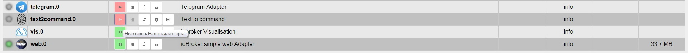
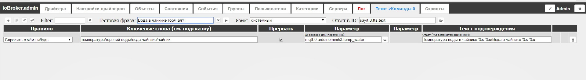

## Описание

Драйвер **text2command **(Text to command) используется для анализа полученной текстовой информации и выполнения команд в соответствии с заранее определенным набором правил. Установка и настройка этого драйвера не требует наличия других драйверов в системе, однако используется он совместно с другими адаптерами, которые передают текстовые выражения, к примеру [telegram](http://www.iobroker.net/?page_id=4492&lang=ru) или приложение для Android - iobroker.vis. Так же драйвер позволяет кроме выполнения различных команд, выдавать различные ответы в текстовом виде, можно использовать для драйвера [sayit](http://www.iobroker.net/?page_id=4262&lang=ru) к примеру (подтверждение принятия команды или просто ответ на вопрос).

## Информация

## Установка

Установка осуществляется на вкладке **Драйвера** странички [администрирования](http://www.iobroker.net/?page_id=3800&lang=ru) системы. В группе драйверов **Скрипты и логика** находим строчку с названием **Text to command** и нажимаем кнопку со значком плюса в этой строке справа. [

 На экране появится всплывающее окно установки драйвера, в конце установки оно автоматически закроется. [

 Если все прошло удачно, на вкладке **Настройка драйверов** появится строка **text2command.0 **с установленным экземпляром драйвера. [

 По-умолчанию драйвер не запущен, чтобы его стартовать, нажимаем на кнопку **Неактивно. Нажать для старта** (красная с иконкой play).  Теперь можно перейти к страничке редактирования правил, для этого нажимаем по кнопке **Открыть приложение** (там же, на вкладке **Настройка драйверов** в строке установленного экземпляра драйвера) либо настройкой админки добавляем вкладку **Текст->Команды.0**.

## Настройка

### Описание главного окна

 Как уже писалось выше, в главное окно настройки правил драйвера можно попасть щелкнув по соответствующей кнопке на вкладке **Настройка драйверов** в строке установленного экземпляра драйвера или добавить вкладку с помощью кнопки редактирования табов. Сверху слева - направо:

*   кнопки управления правилами - создание, сохранение изменений, обновить список и смена ID;
*   поле **Фильтр**, можно отфильтровать список правил по ключевому слову;
*   поле **Тестовая фраза** и кнопки очистить поле, послать тестовую фразу в драйвер - пригодиться при отладке драйвера, можно вписать тестовую фразу (к примеру "Сколько сейчас времени") и нажать на кнопку отправки в драйвер - наблюдать за работой (ответ в сплывающем сообщении);
*   настройка **Язык** (выбор из списка) - основной язык, на котором будет происходить обмен командами и выдача ответов;
*   настройка **Ответ в ID** - если в формате правила присутствует текст подтверждения, то он будет передан в переменную **text2command..response **и в переменную, указанную в данном поле (если заполнено) - можно передавать драйверу **sayit**, к примеру, для голосового подтверждения команды или ответа на вопрос.

При срабатывании драйвера (появился текст на входе), программа проверяет совпадение по всем правилам сверху вниз. Необходимо учитывать, если галочка **Прервать** не установлена, то могут сработать несколько правил, более приоритетные необходимо поднимать вверх списка. Если галочка **Прервать** установлена на первом сработавшем правиле, то драйвер далее проверять правила не будет.

### Синтаксис задания ключевых слов и текста подтверждения

Синтаксис задания ключевых слов может включать в себя регулярные выражения, к примеру `/^light\son|^lamp\son/`. Стоит учитывать, что он чувствителен к регистру. Ключевые слова работают следующим образом:

*   ключевые слова разделяются пробелом.
*   **все** ключевые слова должны присутствовать в предложении, чтобы вызвать правило. Например, ключевые слова: `включи свет` задействуют правило, если на входе будет текст `пожалуйста включи свет` или `включи свет в квартире` и не задействуют правило, если на входе будет текст `включи всё` или `зажги свет`.
*   каждое ключевое слово может иметь **много форм звучания**, вариации ключевого слова должны быть разделены символом "/". Например, ключевые слова: `включи/зажги/дай свет/света` задействуют правило, если на входе будет текст `включи свет` или `зажги пожалуйста свет` или `дай мне света`.
*   ключевое слово может звучать во многих вариациях(падежи, множественное число, глагол/причастие, разговорное ...), все они должны быть перечислены как варианты. Например, `окно/окна/окошко/окошки/форточка/фрамуга/воздух`.
*   вариации ключевого слова могут быть описаны на разных языках, к примеру, ключевая фраза `температура/temp комнате/bedroom` задействует правило, если на входе будет фраза команды голосом `какая температура в комнате?` или команда через бот драйвера [telegram](http://www.iobroker.net/?page_id=4492&lang=ru) `/temp_bedroom`.

Текст для подтверждения может содержать конкретную фразу или варианты фраз, которые разделяются символом "/" (вариант выбирается рандомно). К примеру, текст подтверждения правила **как тебя зовут** можно составить в виде: `Меня зовут Катя/Катюша/Екатерина моё имя/My name is Ekaterina`. В тексте подтверждения возможно применение автоподстановки при работе с определенными правилами (к примеру запрос температуры). Используется следующий синтаксис:

*   %s - вставка значения переменной (ID переменной задается в параметре правила),
*   %u - вставка еденицы измерения переменной,
*   %n - вставка имя переменной.

### Использование функций и категорий

Чтобы использовать правила **Включить/отключить приборы** или **поднять/опустить ставни** (см. ниже) нужно настроить категории функций и комнат. Группы категорий и сами категории создаются и настраиваются на вкладке **Категории** странички администрирования системы. Следующие функции могут быть использованы: **Свет - enum.functions.light**

*   диммирование (управление уровнем освещения) - роль - level.dimmer,
*   дискретное управление (включить/выключить) - роль - switch.light,

**Подсветка - enum.functions.backlight**

*   диммирование (управление уровнем подсветки) - роль - level.backlight,
*   дискретное управление (включить/выключить) - роль - switch.backlight,

**Жалюзи/окна - enum.functions.blinds/shutter**

*   аналоговое управление (уровень открытия) - роль - level.blind,
*   дискретное управление (открыть/закрыть) - роль - switch.blind,

**Шторы - enum.functions.curtain**

*   аналоговое управление (уровень открытия) - роль - level.curtain,
*   дискретное управление (открыть/закрыть) - роль - switch.curtain,

**Отопление/подогрев - enum.functions.heating**

*   аналоговое управление (температура) - роль - level.temperature,
*   дискретное управление (включить/выключить) - роль - switch.temperature,

**Музыка - enum.functions.music**

*   воспроизведение - роль - button.play,
*   стоп/пауза - роль - button.stop / button.pause,

**Охрана - enum.functions.alarm/security**

*   постановка/снятие с охраны - роль - switch.security,

**Замок - enum.functions.lock**

*   закрыть - роль - switch.lock,
*   открыть - роль - switch.open,

Следующие помещения могут быть задействованы:

*   зал
*   спальня
*   ванная
*   кабинет
*   детская
*   гостевой туалет
*   туалет
*   коридор/прихожая
*   кухня
*   терраса/балкон
*   столовая
*   гараж
*   лестница
*   сад
*   двор
*   гостевая
*   кладовка
*   крыша
*   сени
*   прачечная
*   котельная
*   сарай
*   теплица

Например, что бы заработало правило "включи свет в зале":

*   state должен быть внесён в enum.rooms.зал;
*   должен иметь роль switch.light
*   должен быть логического типа (boolean)

### Описание правил

При добавлении нового правила, необходимо выбрать из списка основной функционал записи. [

 **Правило Как тебя зовут** Это правило немного сложнее предыдущего, так как маска ответа может быть настроена, результатом работы является вывод текста о персонализации системы (имя электронного помошника). Выводить текст можно в драйвер **sayit** (настроить **Ответ в ID**), можно использовать в скрипте для более сложного ответа или с элементами диалога. Ключевую фразу по-умолчанию **как тебя зовут** можно расширить, добавим элементы разговорного языка, и вариантов ответа тоже можно прописать несколько, разделив их символом "/", к примеру: [

 **Правило Какая температура на улице** Результатом работы этого правила будет вывод текста с текущей температурой на улице. Появляется еще одна дополнительная настройка - **Параметр**, здесь необходимо выбрать переменную, в которой хранится текущая температура окружающего воздуха снаружи здания, т.е. уличную температуру. Это могут быть данные от локальной погодной станции (по MQTT/ModBUS) или настроенный погодный сервис, к примеру драйвера **weatherunderground forecast** (как в приведенном примере на скриншоте), **yr.no** или другие. Ключевые слова, как и синтаксис вывода можно настроить под себя, а для непосредственного вывода значения температуры используется автоподстановка - символы **%s** заменяются на числовое значение переменной (округляется до целого), а **%u** - единицы измерения (в данном случае градусы). К примеру: [

 **Правило Какая температура в доме** Практически аналогичное правилу выше, с той лишь разнице, что для подстановки используется температура в помещении (доме, квартире, офисе...). Исходные данные может предоставить переменная погодной станции с датчиков внутри помещения или отдельные датчики, к примеру, системы отопления. **Правила Включить/Выключить приборы и Поднять/опустить ставни** Чтобы воспользоваться этими правилами, необходимо сначала настроить категории, а именно enum.rooms - помещения, к которым будут применяться правила и enum.functions - чем управлять (окно, отопление, свет и пр.). Эта настройка осуществляется на вкладке **Категории** странички администрирования системы и может выглядеть, к примеру, следующим образом: [

 К каждой категории (комната и функция) нужно привязать соответствующие переменные. К примеру, переменная **mqtt.0.arduinomega51.relay_light1** (контроллер на основе платы arduino с ethernet-shield подключен по MQTT, реле света №1) управляет светом в зале, соответственно этой переменной надо сопоставить комнату - зал, функцию - свет. Сделать это можно на вкладке Категории или Объекты - найти переменную и заполнить соответствующие ячейки, выбрав из списка значения. [caption id="" align="alignnone" width="698"][

 Показано на примере переменной playing драйвера sayit](img/text2commandundefined_text2command-setting1.jpg)
 Дискретное управление: примеры ключевой фразы **включи свет в зале** или **открой окно на кухне**. Если установлена галочка **Ответить подтверждением**, то ответ будет **Включен/отключен %function% в %room%**. Где **%function%** - это выполненная функция, а **%room%** - комната, где сработало правило. Аналоговое управление: примеры ключевой фразы **включи свет в зале на 50**% или **открой шторы на кухне на 80%**. Если установлена галочка **Ответить подтверждением**, то ответ будет **Открыты %function% в %room% на ...%**. Где **%function%** - это выполненная функция, а **%room%** - комната, где сработало правило. **Правило Записать текст в переменную** Это правило позволяет определенной ключевой фразой отправить текстовую информацию в переменную системы. Разберем на примере. Муж занимается делами в гараже, жена на кухне готовит ужин. Имеется настроенный драйвер **sayit.1 **(отличный от sayit.0, через который будет выводиться текст подтверждения),  который выдает звук в гараж на устройство SONOS. Жена на кухне произносит ключевую фразу **Позвать из гаража** и затем сразу текст **Андрей, ужин готов!** (см. тестовую фразу на скриншоте)**.** Настройка будет следующая: 

*   Параметр первый - выбираем переменную, куда будет отправлен текст,
*   Параметр второй - маска для отправки, в данном случае это просто сам текст, символы **%s**,
*   Текст подтверждения - для подтверждения будет произнесен отправленный текст.
*   Ответ в ID - передается в драйвер sayit.0, который настроен для вывода звука в доме/квартире/кухне (чтобы услышать ответ).

Еще пример. В драйвере javascript.0 написан скрипт различных режимов (охрана, тревога, ночь, никого, гости, кино и т.д.), в соответствии с которыми работают остальные скрипты и при смене режима, происходит инициализация определенных переменных. Режимами можно управлять голом (через android app iobroker.vis) или через бота telegram. Настройки правила в таком случае будут примерно следующие: [

 **Правило Что нибудь включить/выключить** Это очень простое в настройке и использовании правило, которое позволяет записать определенное значение в определенную переменную. К примеру, если в систему интегрирован "умный электрический чайник", можно заставить его включиться. В примере чайник управляется с помощью контроллера Arduino c ethernet shield по протоколу MQTT, переменная называется **mqtt.0.arduinomini53.relay_pot**. Чтобы включить чайник, нужно в переменную записать значение **true**, как только он вскипит, контроллер сам опубликует значение **false**. [

 Существует возможность использовать цифровые значения в командах. Если в тексте встречается число, то оно будет использоваться, как значение для управления и предустановленное значение будет проигнорировано. Например "Включи свет на 25%" **Правило Спросить о чем нибудь** Данное правило позволяет в ответе выдать значение (поддерживается авто-подстановка и варианты ответов через символ "/") определенной переменной, к примеру текст - прогноз погоды или цифровое значение - температуру, влажность и пр. Выше приведен пример включения умного чайника, предположим, что он настолько умный, что передает в систему температуру и наличие воды. Поэтому перед включением хорошо бы убедиться, горячий ли он, и есть ли вода. Чтобы узнать температуру (переменная **mqtt.0.arduinomini53.temp_water**), правило будет выглядеть следующим образом: [

 Стоит помнить о том, что на момент активации правила, в переменной уже должна содержаться необходимая информация. **Правила Молодец/Спасибо** Очень простые в использовании и настройки правила. Используются в основном, для поддержания диалога (Just for fun). Ответы можно заменить на собственные - зависит от вашей фантазии 

## Работа с объектами экземпляра драйвера

После установки в систему, драйвер создает две переменные в системе: 

*   **text** - в эту переменную надо передавать текстовую фразу для обработки по правилам,
*   **response** - в этой переменной будет ответ/подтверждение, если это предусмотрено правилом.

Аналогом записи текста в переменную **text** является отправка тестовой фразы из настроек драйвера (реализовано для удобства тестирования работы правил). Если указать в настройках **Ответ в ID** - выбрать переменную (к примеру задействовать драйвер sayit), то ответ будет отправлен и в response, и в указанную переменную (к примеру нужно передать ответ в скрипт для дальнейшей обработки и этот же ответ надо произнести для подтверждения). Можно отправлять текстовые команды из javascript, и через функцию, получать ответ, например: `sendTo('text2command', 'Включить свет на кухне', function (err, response) {` `  console.log('Response is: ' + response);` `});`

## Примеры

Как уже писалось выше, драйвер text2comand используется в связке с другими драйверами и приложением iobroker.vis. Примеры работы с адаптером telegram можно посмотреть на [страничке](http://www.iobroker.net/?page_id=4492&lang=ru) описания этого драйвера.